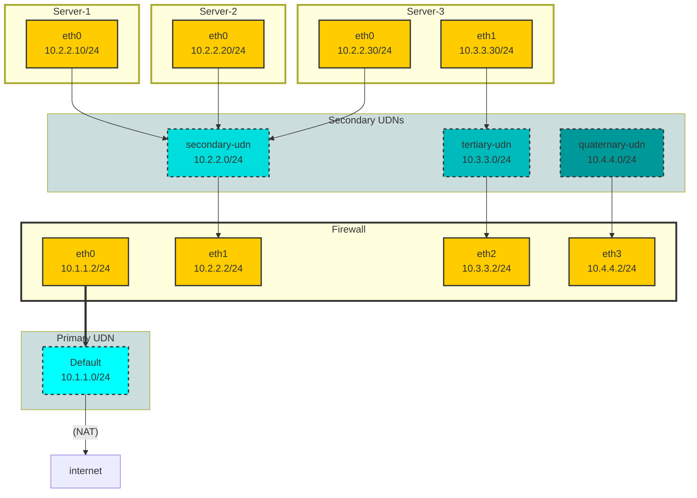

```mermaid
graph TD;
    classDef interface fill:#ffcc00,stroke:#333,stroke-width:2px;
    classDef network fill:#ddd,stroke:#333,stroke-width:2px;
    classDef neighbor fill:#ffeb99,stroke:#333,stroke-width:2px;
    classDef net-1st fill:#00ffff,stroke:#333,stroke-width:2px,stroke-dasharray: 5 5;
    classDef net-2nd fill:#00dddd,stroke:#333,stroke-width:2px,stroke-dasharray: 5 5;
    classDef net-3rd fill:#00bbbb,stroke:#333,stroke-width:2px,stroke-dasharray: 5 5;
    classDef net-4th fill:#009999,stroke:#333,stroke-width:2px,stroke-dasharray: 5 5;

    style nets-1 fill:#cdd
    style nets-2 fill:#cdd
    style Firewall stroke:#333,stroke-width:3px

    subgraph nets-1["Primary UDN"]
        net-1st[Default<br> 10.1.1.0/24]:::net-1st;
    end
        net-1st --(NAT)--> internet

    subgraph nets-2["Secondary UDNs"]
        net-2nd[secondary-udn<br>10.2.2.0/24<br>]:::net-2nd;
        net-3rd[tertiary-udn<br>10.3.3.0/24<br>]:::net-3rd;
        net-4th[quaternary-udn<br>10.4.4.0/24<br>]:::net-4th;
    end

    subgraph Firewall
        eth0[eth0<br>10.1.1.2/24]:::interface;
        eth0 ==> net-1st
        eth1[eth1<br>10.2.2.2/24]:::interface;
        net-2nd --> eth1;
        eth2[eth2<br>10.3.3.2/24]:::interface;
        net-3rd --> eth2;
        eth3[eth3<br>10.4.4.2/24]:::interface;
        net-4th --> eth3;
    end

    subgraph Server-1
        server-1-eth0[eth0<br>10.2.2.10/24]:::interface;
        server-1-eth0 --> net-2nd
    end

    subgraph Server-2
        server-2-eth0[eth0<br>10.2.2.20/24]:::interface;
        server-2-eth0 --> net-2nd
    end

    subgraph Server-3
        server-3-eth0[eth0<br>10.2.2.30/24]:::interface;
        server-3-eth0 --> net-2nd
        server-3-eth1[eth1<br>10.3.3.30/24]:::interface;
        server-3-eth1 --> net-3rd
    end

  classDef servers stroke-width:3px
  class Server-1,Server-2,Server-3 servers
```