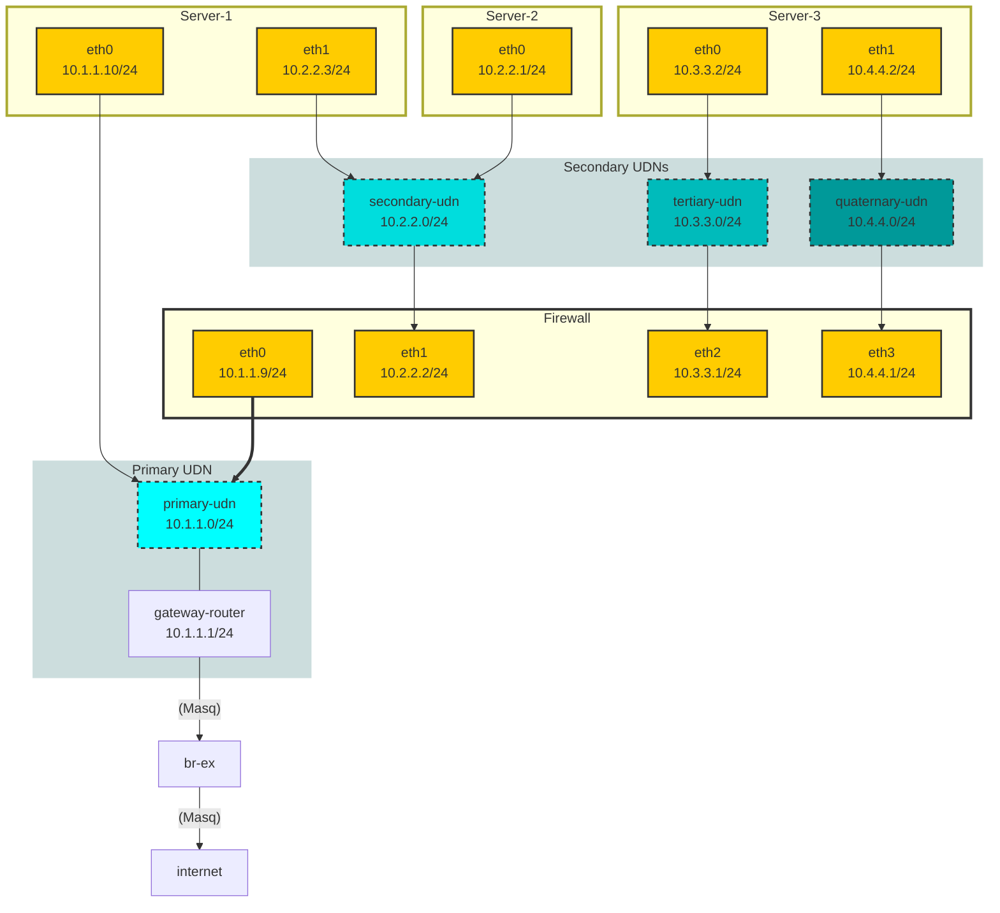

# WIP

* [networks](base/kustomization.yaml) - ( [primary](../components/primary-udn/userdefinednetwork.yaml), [secondary](../components/secondary-udn/userdefinednetwork.yaml), [tertiary](../components/tertiary-udn/userdefinednetwork.yaml), [quaternary](../components/quaternary-udn/userdefinednetwork.yaml) )
* [firewall](vm-firewall/base/kustomization.yaml)
* [server-1](vm-server-1/base/kustomization.yaml)
* [server-2](vm-server-2/base/kustomization.yaml)
* [server-3](vm-server-3/base/kustomization.yaml)

> [!NOTE]
>  There can be only _ONE_ Primary User Defined Network for a namespace.

A _Primary_ Layer2 UDN will have a gateway-router created at IP `x.x.x.1` and pods will use this as their default route. This UDN will be assigned a masquerade IP and traffic will NAT as it egresses towards `br-ex` where it will NAT again as the node IP.

A _Secondary_ Layer2 UDN will have no gateway-router. The network is simply an overlay with no egress, unless a router is built by the user. ie. The Firewall here.

