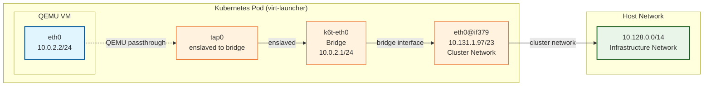

```mermaid
graph LR
    subgraph "Kubernetes Pod (virt-launcher)"
        subgraph "QEMU VM"
            VM_eth0["eth0<br/>10.0.2.2/24"]
        end

        tap0["tap0<br/>enslaved to bridge"]
        k6t_eth0["k6t-eth0<br/>Bridge<br/>10.0.2.1/24"]
        pod_eth0["eth0@if379<br/>10.131.1.97/23<br/>Cluster Network"]
    end

    subgraph "Host Network"
        host_network["10.128.0.0/14<br/>Infrastructure Network"]
    end

    %% Connections
    VM_eth0 -.->|"QEMU passthrough"| tap0
    tap0 -->|"enslaved"| k6t_eth0
    k6t_eth0 -->|"bridge interface"| pod_eth0
    pod_eth0 -->|"cluster network"| host_network

    %% Styling
    classDef vmBox fill:#e1f5fe,stroke:#01579b,stroke-width:2px
    classDef podBox fill:#f3e5f5,stroke:#4a148c,stroke-width:2px
    classDef networkBox fill:#e8f5e8,stroke:#1b5e20,stroke-width:2px
    classDef interfaceBox fill:#fff3e0,stroke:#e65100,stroke-width:1px

    class VM_eth0 vmBox
    class tap0,k6t_eth0,pod_eth0 interfaceBox
    class host_network networkBox
```