# Virt-Launcher Pod Default Interfaces Diagram

```mermaid
graph LR
    subgraph "Kubernetes Cluster"
        subgraph "Cluster Network (10.128.0.0/14)<br/>"
            INFRA_NET[Host Subnet<br/>10.131.0/23]
        end

        subgraph VIRT_LAUNCHER[Virt-Launcher Pod]
            ETH0["eth0@if379<br/>10.131.1.97/23<br/>Cluster Network"]

            subgraph "VM Bridge Network (10.0.2.0/24)"
                BRIDGE[k6t-eth0<br/>Bridge Interface<br/>10.0.2.1/24]
                TAP0[tap0<br/>VM Connection]
            end

            subgraph "Virtual Machine"
                VM_ETH0[VM eth0<br/>10.0.2.2/24<br/>Same IP in Every VM]
            end
        end
    end
    Inet["☁️"]

    %% Network Connections
    INFRA_NET -->|"Infrastructure Access"| ETH0
    ETH0 --> BRIDGE
    BRIDGE -->|"Enslaves"| TAP0
    TAP0 -->|"Passed to QEMU"| VM_ETH0
    VM_ETH0 -.->|"Masquerades as Pod eth0@if379"| Inet

    %% Styling
    classDef infraStyle fill:#e1f5fe,stroke:#01579b,stroke-width:2px
    classDef podStyle fill:#f3e5f5,stroke:#4a148c,stroke-width:2px
    classDef bridgeStyle fill:#fff3e0,stroke:#e65100,stroke-width:2px
    classDef vmStyle fill:#e8f5e8,stroke:#1b5e20,stroke-width:2px
    classDef configStyle fill:#fce4ec,stroke:#880e4f,stroke-width:1px

    class INFRA_NET,ETH0 infraStyle
    class VIRT_LAUNCHER podStyle
    class BRIDGE,TAP0 bridgeStyle
    class VM,VM_ETH0 vmStyle
    class ETH0_CONFIG,BRIDGE_CONFIG,TAP_CONFIG configStyle
```

## Key Components

### Dual Network Interfaces
1. **eth0@if379**: `10.131.1.97/23`
   - Connected to cluster network `10.131.0.0/23`
   - Provides infrastructure access and cluster connectivity
   - Handles kubelet health checks and cluster operations

2. **k6t-eth0**: `10.0.2.1/24`
   - Bridge interface on VM network `10.0.2.0/24`
   - Short for "kubevirt-eth0"
   - Enslaves tap0 interface for VM connectivity

### Bridge Architecture
- **k6t-eth0**: Bridge interface that connects Pod to VM
- **tap0**: Virtual interface enslaved to bridge
- **VM Connection**: tap0 is passed to QEMU for VM eth0

### Network Segregation
- **Infrastructure Network** (`10.128.0.0/14`): For cluster operations
- **Pod Network** (`10.131.0.0/23`): Standard pod networking
- **VM Bridge Network** (`10.0.2.0/24`): Isolated VM network

## Traffic Flow

1. **Infrastructure Traffic**:
   - Cluster operations → eth0 → Infrastructure network

2. **VM Traffic**:
   - VM → tap0 → k6t-eth0 bridge → Pod routing
   - Pod → eth0 → Cluster network

3. **Bridge Function**:
   - k6t-eth0 acts as gateway for VM network
   - Provides isolation between VM and infrastructure networks
