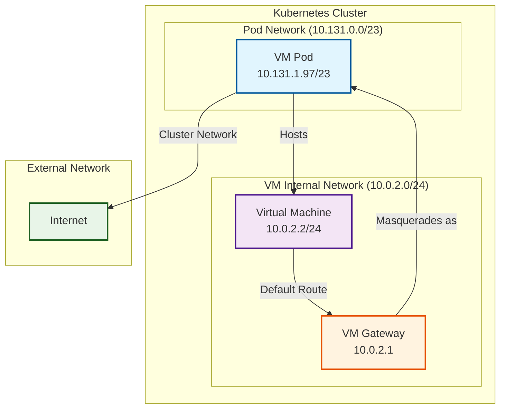

# Virtual Machine Networking Diagram

## Key Points

- **VM Internal IP**: `10.0.2.2/24` (always static)
- **Pod IP**: `10.131.1.97/23` (assigned by cluster)
- **VM Gateway**: `10.0.2.1` (handles routing)
- **Masquerading**: VM traffic appears to come from pod IP `10.131.1.97/23`
- **Network Isolation**: VM operates in separate `10.0.2.0/24` subnet within pod

## Network Flow

1. VM sends traffic to `10.0.2.1` (default gateway)
2. Gateway masquerades traffic to appear from pod IP `10.131.1.97/23`
3. Traffic flows through pod network to external destinations
4. Return traffic follows reverse path through pod network
