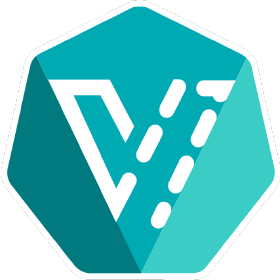

<!-- _paginate: skip -->
<!-- _ffffooter: _[Dale Bewley](www.linkedin.com/in/dalebewley) - <https://github.com/dlbewley/demo-cni/>_ -->
<!-- _class: title invert -->
<!-- _footer: '[github.com/dlbewley/demo-cni](https://github.com/dlbewley/demo-cni/)' -->

# OpenShift Virtualization VM Networking

### Dale Bewley

> ### Specialist SA
> NA West OpenShift 🐯 Team
> Red Hat


---
<!-- footer: '**[Dale Bewley](www.linkedin.com/in/dalebewley)**
         **|**
         **[github.com/dlbewley/demo-cni](https://github.com/dlbewley/demo-cni/)**' -->

---
<!-- paginate: true -->
<!-- class: icon -->
<!-- header: CNI -->
<style scoped>
  section {columns: 2; 
  column-rule: 1px solid #ccc; }
  p, h1, h2 { column-span: all; }
</style>

# Multus Meta CNI Plugin
> The CNI used by OpenShift
> Is a meta-plugin which executes other plugins

Creates the interfaces in the pod used by the VM


---
<!-- class: icon -->
<style scoped>
  section {columns: 2; 
  column-rule: 1px solid #ccc; }
  p, h1, h2 { column-span: all; }
</style>

# Container Network Interface

CNI Plugins enable pod network configuration 

```json
{
    "cniVersion": "0.3.1",
    "name": "mynet",
    "type": 🔌 <plugin>
    <parameters>...
}
```

### 🔌 Bridge
### 🔌 ovn-k8s-cni-overlay
### 🔌 SR-IoV
### 🔌 ...


---
<style scoped>
  section { columns: 2; 
  column-rule: 1px solid #ccc; }
  p, h1, h2 { column-span: all; }
</style>

## 🔌 CNI Plugins

There are many plugins and they may be chained by Multus

```bash
$ oc rsh -n openshift-multus \
  multus-2tt2c \
  ls -1 /var/lib/cni/bin
bandwidth
bond
bridge
cert-approver
cnv-bridge
cnv-tuning
dhcp
dummy
egress-router
firewall
```

```bash
host-device
host-local
install_multus
ip-control-loop
ipvlan
kubeconfig_generator
loopback
macvlan
multus
multus-daemon
multus-shim
network-passt-binding
ovn-k8s-cni-overlay
...
```

---

### 🔌 [bridge](https://www.cni.dev/plugins/current/main/bridge/) Plugin

> Don't use cnv-bridge, use bridge. They are identical.

Bridge can be used to attach to a Linux Bridge which may enable VLAN access or [VGT](https://guifreelife.com/blog/2025/01/02/OpenShift-Virtualization-VLAN-Guest-Tagging/)

```json
{
    "cniVersion": "0.3.1",
    "name": "mynet",
    "type": "bridge",
    ...
}
```

---
<!-- class: icon -->

### 🔌 ovn-k8s-cni-overlay Plugin

```json
{
    "cniVersion": "0.3.1",
    "name": "mynet",
    "type": "ovn-k8s-cni-overlay",
    "topology": 🌐 <topology>,
    ...
}
```


---
<!-- class: icon -->
<!-- header: Agenda -->
<style scoped>
  section {columns: 2; 
  column-rule: 1px solid #ccc; }
  p, h1, h2 { column-span: all; }
</style>
> Discussion of network attachments available for Virtual Machines on OpenShift with example implementations

# KubeVirt Interfaces and Networks
### 🛜 Primary Cluster Network
### 🛜 Primary User Defined Networks  
### 🛜 Secondary Localnet (VLANs)
### 🛜 Secondary User Defined Networks  



---
<!-- class: invert icon -->
<!-- header: Cluster Network -->
<style scoped> section { columns: 2; } </style>

# VM Examples - Cluster Network

All VMs have the same address internally and masquerade using the pod IP.


```yaml
# VM attached to default cluster network
apiVersion: kubevirt.io/v1
kind: VirtualMachine
metadata:
  name: vm-on-cluster-network
spec:
  template:
    spec:
      domain:
        devices:
          interfaces:
            - macAddress: '02:86:5e:00:00:07'
              masquerade: {}
              model: virtio
              name: default
      networks:
        - name: default
          pod: {}        
```


---
<!-- class: default -->
#### Virt-Launcher Pod
Two ethernet interfaces in the virt launcher pod. 
* Infrastructure locked `10.128.0.0/14` cluster network 
* Always on `10.0.2.1/24`
* `k6t-eth0` short for `kubevirt-eth0` is a bridge enslaving `tap0`
* `tap0` is passed to QEMU for `eth0` in the VM

```bash
sh-5.1$ ip -c link
1: lo: <LOOPBACK,UP,LOWER_UP> mtu 65536 qdisc noqueue state UNKNOWN mode DEFAULT group default qlen 1000
    link/loopback 00:00:00:00:00:00 brd 00:00:00:00:00:00
2: eth0@if379: <BROADCAST,MULTICAST,UP,LOWER_UP> mtu 1400 qdisc noqueue state UP mode DEFAULT group default 
    link/ether 0a:58:0a:83:01:61 brd ff:ff:ff:ff:ff:ff link-netnsid 0
3: k6t-eth0: <BROADCAST,MULTICAST,UP,LOWER_UP> mtu 1400 qdisc noqueue state UP mode DEFAULT group default qlen 1000
    link/ether 02:00:00:00:00:00 brd ff:ff:ff:ff:ff:ff
4: tap0: <BROADCAST,MULTICAST,UP,LOWER_UP> mtu 1400 qdisc fq_codel master k6t-eth0 state UP mode DEFAULT group default qlen 1000
    link/ether be:53:ae:c8:c5:66 brd ff:ff:ff:ff:ff:ff

sh-5.1$ ip -br -c -4 a
lo               UNKNOWN        127.0.0.1/8 
eth0@if379       UP             10.131.1.97/23 
k6t-eth0         UP             10.0.2.1/24  
```
---
#### Virtual Machine

* VM _always_ has IP `10.0.2.2/24`. 
* Masquerades as pod IP `10.131.1.97/23` above.

```bash
[cloud-user@vm-pod ~]$ ip -c link
1: lo: <LOOPBACK,UP,LOWER_UP> mtu 65536 qdisc noqueue state UNKNOWN mode DEFAULT group default qlen 1000
    link/loopback 00:00:00:00:00:00 brd 00:00:00:00:00:00
2: eth0: <BROADCAST,MULTICAST,UP,LOWER_UP> mtu 1400 qdisc fq_codel state UP mode DEFAULT group default qlen 1000
    link/ether 02:86:5e:00:00:10 brd ff:ff:ff:ff:ff:ff
    altname enp1s0

[cloud-user@vm-pod ~]$ ip -br -c -4 a
lo               UNKNOWN        127.0.0.1/8 
eth0             UP             10.0.2.2/24 

[cloud-user@vm-pod ~]$ ip -c route
default via 10.0.2.1 dev eth0 proto dhcp src 10.0.2.2 metric 100 
10.0.2.0/24 dev eth0 proto kernel scope link src 10.0.2.2 metric 100 
```

---
# VM on Default Cluster Network 

## Summary

### Virt-launcher Pods
* eth0 on cluster network `10.128.0.0/14`
* k6t-eth0 always has IP `10.0.2.1/24`

### VirtualMachines
* eth0 is always IP `10.0.2.2/24`
* Default gateway is always `10.0.2.1` on virt-launcher pod
* Masquerades at pod edge as IP of the virt-launcher pod
* Masquerades at node edge as IP of node default interface `br-ex`

---
<!-- _class: invert -->
<!-- header: Primary User Defined Network -->
<style scoped>
section { columns: 2; }
 h1 { column-span: all; }
</style>
# VM Examples - Primary UDN

## VMs have unique IPs from UDN subnet

Only Layer2 topology is supported (`localnet` soon)

```yaml
apiVersion: k8s.ovn.org/v1
kind: UserDefinedNetwork
  name: primary-udn
spec:
  topology: Layer2
  layer2:
    ipam:
      lifecycle: Persistent
    role: Primary
    subnets:
      - 10.1.1.0/24
```
---
<!-- _class: invert icon -->
<!-- header: Primary User Defined Network -->
<style scoped>
  section {columns: 2; 
  column-rule: 1px solid #ccc; }
 h1 { column-span: all; }
</style>
...continued
```yaml
# VM attached to primary UDN
apiVersion: kubevirt.io/v1
kind: VirtualMachine
metadata:
  name: vm-on-primary-udn
spec:
  template:
    spec:
      domain:
        devices:
          interfaces:
            - binding:
                name: l2bridge
              model: virtio
              name: default      
      networks:
        - name: default
          pod: {}        
```


---
<!-- class: default -->
## Virt-Launcher Pod

Two ethernet interfaces in the virt launcher pod. 
* Infrastructure locked `10.128.0.0/14` cluster network  for kubelet health checks _only_
* Unique IP on the UDN range `10.1.1.0/24`

```bash
sh-5.1$ ip -c link
1: lo: <LOOPBACK,UP,LOWER_UP> mtu 65536 qdisc noqueue state UNKNOWN mode DEFAULT group default qlen 1000
    link/loopback 00:00:00:00:00:00 brd 00:00:00:00:00:00
2: eth0@if356: <BROADCAST,MULTICAST,UP,LOWER_UP> mtu 1400 qdisc noqueue state UP mode DEFAULT group default 
    link/ether 0a:58:0a:83:01:4b brd ff:ff:ff:ff:ff:ff link-netnsid 0
3: ovn-udn1-nic@if357: <BROADCAST,MULTICAST,UP,LOWER_UP> mtu 1400 qdisc noqueue master k6t-ovn-udn1 state UP mode DEFAULT group default 
    link/ether 06:1b:c3:df:4d:d3 brd ff:ff:ff:ff:ff:ff link-netnsid 0
4: k6t-ovn-udn1: <BROADCAST,MULTICAST,UP,LOWER_UP> mtu 1400 qdisc noqueue state UP mode DEFAULT group default qlen 1000
    link/ether 06:1b:c3:df:4d:d3 brd ff:ff:ff:ff:ff:ff
5: tap0: <BROADCAST,MULTICAST,UP,LOWER_UP> mtu 1400 qdisc fq_codel master k6t-ovn-udn1 state UP mode DEFAULT group default qlen 1000
    link/ether 82:38:45:e8:1a:3d brd ff:ff:ff:ff:ff:ff
6: ovn-udn1: <BROADCAST,NOARP> mtu 1400 qdisc noop state DOWN mode DEFAULT group default qlen 1000
    link/ether 0a:58:0a:01:01:03 brd ff:ff:ff:ff:ff:ff

sh-5.1$ ip -br -c -4 a
lo               UNKNOWN        127.0.0.1/8 
eth0@if356       UP             10.131.1.75/23 
ovn-udn1         DOWN           10.1.1.3/24 
```
---
## Virtual Machine
One ethernet interface in the VM with IP from primary UDN

```bash
[cloud-user@vm-primary-udn ~]$ ip -c link
1: lo: <LOOPBACK,UP,LOWER_UP> mtu 65536 qdisc noqueue state UNKNOWN mode DEFAULT group default qlen 1000
    link/loopback 00:00:00:00:00:00 brd 00:00:00:00:00:00
2: eth0: <BROADCAST,MULTICAST,UP,LOWER_UP> mtu 1400 qdisc fq_codel state UP mode DEFAULT group default qlen 1000
    link/ether 0a:58:0a:01:01:03 brd ff:ff:ff:ff:ff:ff
    altname enp1s0

[cloud-user@vm-primary-udn ~]$ ip -br -c -4 a
lo               UNKNOWN        127.0.0.1/8 
eth0             UP             10.1.1.3/24 

[cloud-user@vm-primary-udn ~]$ ip -c route
default via 10.1.1.1 dev eth0 proto dhcp src 10.1.1.3 metric 100 
10.1.1.0/24 dev eth0 proto kernel scope link src 10.1.1.3 metric 100 
```
---
## VM on Primary User Defined Network 

### Virt-Launcher Pod
* Two ethernet interfaces
* eth0@if356 is on infrastructure locked cluster network `10.128.0.0/14`
* ovn-udn1 is on primary UDN `10.1.1.3/24`

### Virtual Machine
* eth0 has unique IP `10.1.1.3/24` from primary UDN of this Namespace
* Default gateway is `10.1.1.1`
* Masquerades at UDN gateway rotuer as the IP from `169.254.0.0/17` associated with the UDN
* Masquerades at node edge as IP of node default interface `br-ex`
---
<style scoped>section {columns: 2;}</style>
## Masquerade Subnet
Each UDN has two IPs allocated from the masquerade subnet `169.254.0.0/17`.
```yaml
# oc get network.operator/cluster -o yaml
apiVersion: operator.openshift.io/v1
kind: Network
metadata:
  name: cluster
spec:
  clusterNetwork:
  - cidr: 10.128.0.0/14
    hostPrefix: 23
  defaultNetwork:
    ovnKubernetesConfig:
      egressIPConfig: {}
      gatewayConfig:
        ipv4: {} # <-- default: 169.254.0.0/17
        ipv6: {} # <-- default: fd69::/112
        routingViaHost: false
```

---
<!-- _class: invert -->
<!-- header: Primary & Secondary User Defined Networks -->
<style scoped>
  section  { columns: 2; }
  h1 { column-span: all; }
</style>
# VM Examples - Primary and Secondary UDN

```yaml
apiVersion: k8s.ovn.org/v1
kind: UserDefinedNetwork
  name: primary-udn
spec:
  topology: Layer2
  layer2:
    ipam:
      lifecycle: Persistent
    role: Primary
    subnets:
      - 10.1.1.0/24
```

```yaml
apiVersion: k8s.ovn.org/v1
kind: UserDefinedNetwork
  name: secondary-udn
spec:
  topology: Layer2
  layer2:
    ipam:
      lifecycle: Persistent
    role: Secondary
    subnets:
      - 10.2.2.0/24
```
---
<!-- _class: invert icon -->
<!-- header: Primary & Secondary User Defined Networks -->
<style scoped>  { columns: 2; } </style>
...continued

```yaml
# VM attached to primary UDN and secondary UDN
apiVersion: kubevirt.io/v1
kind: VirtualMachine
metadata:
  name: vm-on-primary-udn
spec:
  template:
    spec:
      domain:
        devices:
          interfaces:
            - binding:
                name: l2bridge
              model: virtio
              name: default
            - bridge: {}
              macAddress: '02:86:5e:00:00:0a'
              model: virtio
              name: secondary-udn
      networks:
        - name: default
          pod: {}        
        - multus:
            networkName: secondary-udn
          name: secondary-udn
```


---
<!-- class: default -->
## Virt-Launcher Pod

```bash
sh-5.1$ ip -c link
1: lo: <LOOPBACK,UP,LOWER_UP> mtu 65536 qdisc noqueue state UNKNOWN mode DEFAULT group default qlen 1000
    link/loopback 00:00:00:00:00:00 brd 00:00:00:00:00:00
2: eth0@if412: <BROADCAST,MULTICAST,UP,LOWER_UP> mtu 1400 qdisc noqueue state UP mode DEFAULT group default 
    link/ether 0a:58:0a:83:01:80 brd ff:ff:ff:ff:ff:ff link-netnsid 0
3: ovn-udn1-nic@if413: <BROADCAST,MULTICAST,UP,LOWER_UP> mtu 1400 qdisc noqueue master k6t-ovn-udn1 state UP mode DEFAULT group default 
    link/ether 92:16:66:87:e3:d3 brd ff:ff:ff:ff:ff:ff link-netnsid 0
4: 2eae7330186-nic@if414: <BROADCAST,MULTICAST,UP,LOWER_UP> mtu 1400 qdisc noqueue master k6t-2eae7330186 state UP mode DEFAULT group default 
    link/ether 26:fc:0d:92:fe:71 brd ff:ff:ff:ff:ff:ff link-netnsid 0
5: k6t-ovn-udn1: <BROADCAST,MULTICAST,UP,LOWER_UP> mtu 1400 qdisc noqueue state UP mode DEFAULT group default qlen 1000
    link/ether 92:16:66:87:e3:d3 brd ff:ff:ff:ff:ff:ff
6: tap0: <BROADCAST,MULTICAST,UP,LOWER_UP> mtu 1400 qdisc fq_codel master k6t-ovn-udn1 state UP mode DEFAULT group default qlen 1000
    link/ether ea:a8:63:f5:7c:f7 brd ff:ff:ff:ff:ff:ff
7: ovn-udn1: <BROADCAST,NOARP> mtu 1400 qdisc noop state DOWN mode DEFAULT group default qlen 1000
    link/ether 0a:58:0a:01:01:03 brd ff:ff:ff:ff:ff:ff
8: k6t-2eae7330186: <BROADCAST,MULTICAST,UP,LOWER_UP> mtu 1400 qdisc noqueue state UP mode DEFAULT group default qlen 1000
    link/ether 26:fc:0d:92:fe:71 brd ff:ff:ff:ff:ff:ff
9: tap2eae7330186: <BROADCAST,MULTICAST,UP,LOWER_UP> mtu 1400 qdisc fq_codel master k6t-2eae7330186 state UP mode DEFAULT group default qlen 1000
    link/ether 32:64:42:71:34:80 brd ff:ff:ff:ff:ff:ff
10: pod2eae7330186: <BROADCAST,NOARP> mtu 1400 qdisc noop state DOWN mode DEFAULT group default qlen 1000
    link/ether 02:00:0a:02:02:03 brd ff:ff:ff:ff:ff:ff

sh-5.1$ ip -br -c -4 a
lo               UNKNOWN        127.0.0.1/8 
eth0@if412       UP             10.131.1.128/23 
ovn-udn1         DOWN           10.1.1.3/24 
k6t-2eae7330186  UP             169.254.75.11/32 
pod2eae7330186   DOWN           10.2.2.1/24 
```
---
## Virtual Machine

```bash
[cloud-user@vm-secondary-udn ~]$ ip -c link
1: lo: <LOOPBACK,UP,LOWER_UP> mtu 65536 qdisc noqueue state UNKNOWN mode DEFAULT group default qlen 1000
    link/loopback 00:00:00:00:00:00 brd 00:00:00:00:00:00
2: eth0: <BROADCAST,MULTICAST,UP,LOWER_UP> mtu 1400 qdisc fq_codel state UP mode DEFAULT group default qlen 1000
    link/ether 0a:58:0a:01:01:03 brd ff:ff:ff:ff:ff:ff
    altname enp1s0
3: eth1: <BROADCAST,MULTICAST,UP,LOWER_UP> mtu 1400 qdisc fq_codel state UP mode DEFAULT group default qlen 1000
    link/ether 02:00:0a:02:02:03 brd ff:ff:ff:ff:ff:ff
    altname enp2s0

[cloud-user@vm-secondary-udn ~]$ ip -br -c -4 a
lo               UNKNOWN        127.0.0.1/8 
eth0             UP             10.1.1.3/24 
eth1             UP             10.2.2.1/24 

[cloud-user@vm-secondary-udn ~]$ ip -c route
default via 10.1.1.1 dev eth0 proto dhcp src 10.1.1.3 metric 100 
10.1.1.0/24 dev eth0 proto kernel scope link src 10.1.1.3 metric 100 
10.2.2.0/24 dev eth1 proto kernel scope link src 10.2.2.1 metric 101
```
---
<style scoped> section {  font-size: 150%; /* or smaller */ } </style>
## Summary VM on Primary & Secondary User Defined Network 

### Virt-Launcher Pod
* Three ethernet interfaces
* eth0@if412 is on infrastructure locked cluster network `10.128.0.0/14`
* ovn-udn1 is on primary UDN `10.1.1.3/24`
* pod2eae7330186 is on secondary UDN `10.2.2.1/24`

### Virtual Machine
* eth0 has unique IP `10.1.1.3/24` from primary UDN of this Namespace
* eth1 has unique IP `10.2.2.1/24` from secondary UDN of this Namespace
* Default gateway is `10.1.1.1`
* Masquerades at UDN gateway router as the IP from `169.254.0.0/17` for the UDN
* Masquerades at node edge as IP of node default interface `br-ex`


---
<!-- _class: invert icon -->
<!-- header: Secondary Network Localnet -->
<style scoped>
  section  {
    font-size: 1.20em;
    columns: 2;
    }
  h1 { column-span: all; }
</style>

# VM Examples - Localnet Secondary 

## VMs directly attached to VLAN

No UDN support for localnet topology as of 4.18.9.
Net-attach-def only.

```yaml
apiVersion: k8s.cni.cncf.io/v1
kind: NetworkAttachmentDefinition
metadata:
  name: demo-vlan-1924
spec:
  config: |-
    {
    "cniVersion": "0.4.0", 
    "name": "demo-vlan-1924",
    "type": "ovn-k8s-cni-overlay", 
    "topology": "localnet", 
    "netAttachDefName": "demo-vm-localnet/demo-vlan-1924",
    "vlanID": 1924,
    "ipam": {}
    }
```

```yaml
# VM attached to secondary localnet
apiVersion: kubevirt.io/v1
kind: VirtualMachine
metadata:
  name: vm-localnet
spec:
  template:
    spec:
      domain:
        devices:
          interfaces:
            - macAddress: '02:86:5e:00:00:13'
              masquerade: {}
              model: virtio
              name: default
            - bridge: {}
              macAddress: '02:86:5e:00:00:14'
              model: virtio
              name: nic-vlan-1924
      networks:
        - name: default
          pod: {}
        - multus:
            networkName: demo-vlan-1924
          name: nic-vlan-1924
```


---
<!-- class: default -->
### Virt-Launcher Pod

```bash
sh-5.1$ ip -c link
1: lo: <LOOPBACK,UP,LOWER_UP> mtu 65536 qdisc noqueue state UNKNOWN mode DEFAULT group default qlen 1000
    link/loopback 00:00:00:00:00:00 brd 00:00:00:00:00:00
2: eth0@if607: <BROADCAST,MULTICAST,UP,LOWER_UP> mtu 1400 qdisc noqueue state UP mode DEFAULT group default
    link/ether 0a:58:0a:83:00:54 brd ff:ff:ff:ff:ff:ff link-netnsid 0
3: 16711a0a730-nic@if608: <BROADCAST,MULTICAST,UP,LOWER_UP> mtu 1400 qdisc noqueue master k6t-16711a0a730 state UP mode DEFAULT group default
    link/ether 12:6f:ef:f4:36:9a brd ff:ff:ff:ff:ff:ff link-netnsid 0
4: k6t-eth0: <BROADCAST,MULTICAST,UP,LOWER_UP> mtu 1400 qdisc noqueue state UP mode DEFAULT group default qlen 1000
    link/ether 02:00:00:00:00:00 brd ff:ff:ff:ff:ff:ff
5: tap0: <BROADCAST,MULTICAST,UP,LOWER_UP> mtu 1400 qdisc fq_codel master k6t-eth0 state UP mode DEFAULT group default qlen 1000
    link/ether 8a:47:bc:d4:8b:d0 brd ff:ff:ff:ff:ff:ff
6: k6t-16711a0a730: <BROADCAST,MULTICAST,UP,LOWER_UP> mtu 1400 qdisc noqueue state UP mode DEFAULT group default qlen 1000
    link/ether 12:6f:ef:f4:36:9a brd ff:ff:ff:ff:ff:ff
7: tap16711a0a730: <BROADCAST,MULTICAST,UP,LOWER_UP> mtu 1400 qdisc fq_codel master k6t-16711a0a730 state UP mode DEFAULT group default qlen 1000
    link/ether 7a:f1:ab:eb:e9:e1 brd ff:ff:ff:ff:ff:ff
8: pod16711a0a730: <BROADCAST,NOARP> mtu 1400 qdisc noop state DOWN mode DEFAULT group default qlen 1000
    link/ether 02:86:5e:00:00:16 brd ff:ff:ff:ff:ff:ff

sh-5.1$ ip -br -c -4 a
lo               UNKNOWN        127.0.0.1/8
eth0@if607       UP             10.131.0.84/23
k6t-eth0         UP             10.0.2.1/24
```
---
### Virtual Machine

```bash
[cloud-user@vm-localnet ~]$ ip -c link
1: lo: <LOOPBACK,UP,LOWER_UP> mtu 65536 qdisc noqueue state UNKNOWN mode DEFAULT group default qlen 1000
    link/loopback 00:00:00:00:00:00 brd 00:00:00:00:00:00
2: eth0: <BROADCAST,MULTICAST,UP,LOWER_UP> mtu 1400 qdisc fq_codel state UP mode DEFAULT group default qlen 1000
    link/ether 02:86:5e:00:00:15 brd ff:ff:ff:ff:ff:ff
    altname enp1s0
3: eth1: <BROADCAST,MULTICAST,UP,LOWER_UP> mtu 1400 qdisc fq_codel state UP mode DEFAULT group default qlen 1000
    link/ether 02:86:5e:00:00:16 brd ff:ff:ff:ff:ff:ff
    altname enp2s0

[cloud-user@vm-localnet ~]$ ip -br -c -4 a
lo               UNKNOWN        127.0.0.1/8
eth0             UP             10.0.2.2/24
eth1             UP             192.168.4.71/24

[cloud-user@vm-localnet ~]$ ip -c route
default via 10.0.2.1 dev eth0 proto dhcp src 10.0.2.2 metric 100
default via 192.168.4.1 dev eth1 proto dhcp src 192.168.4.71 metric 101
10.0.2.0/24 dev eth0 proto kernel scope link src 10.0.2.2 metric 100
192.168.4.0/24 dev eth1 proto kernel scope link src 192.168.4.71 metric 101
```
---
## Summary VM on Localnet
### Virt-launcher Pod
* eth0@if607 is on the cluster network `10.128.0.0/14`
* tap0 is passed to QEMU for eth0
* tap16711a0a730 is passed to QEMU for eth1

### Virtual Machine
* eth0 is always IP `10.0.2.2/24`
* Default gateway is always `10.0.2.1` on virt-launcher
* Masquerades at node edge as IP of node default interface `br-ex`
* eth1 is `192.168.4.71/24` from DHCP on datacenter VLAN 1924

---
<!-- _class: invert icon -->
<!-- header: Secondary UDN Localnet -->
<style scoped>
  section  {
    font-size: 1.20em;
    columns: 2;
    }
  h1 { column-span: all; }
</style>

# VM Examples - Localnet Secondary UDN

## VMs directly attached to VLAN

### TBD
⏳ Support for UDN localnet topology is targeted for 4.19.

---
<!-- header: '' -->
## Q&A / further reading

* [CNI Spec](https://github.com/containernetworking/cni/blob/main/SPEC.md)
---
# References
## CNI spec & OVN‑Kubernetes overview

### 2. OVN–Kubernetes (Primary CNI)

* **ovn‑kubernetes GitHub**  
  * Website: [ovn-kubernetes.io/](https://ovn-kubernetes.io/)
  * Repo: [ovn-org/ovn-kubernetes](https://github.com/ovn-org/ovn-kubernetes)  
  * Core repo for the OVN–Kubernetes integration: CNI binaries, controllers, docs.  
* **OpenShift OVN‑Kubernetes Guide**  
  * Docs: [OpenShift Container Platform Networking – OVN‑Kubernetes](https://docs.redhat.com/en/documentation/openshift_container_platform/4.18/html/networking/index)
  * Red Hat's overview of

